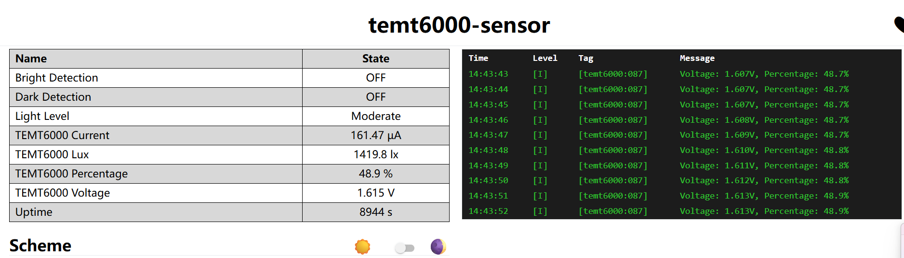

# 自动屏幕亮度调节工具

[](https://github.com/14790897/auto_display_light/actions/workflows/build-release.yml)

基于 ESPHome TEMT6000 光照传感器的 Windows 屏幕亮度自动调节工具。

## ✨ 功能特点

- 🌞 **自动亮度调节** - 根据环境光线自动调整屏幕亮度
- 🎨 **系统托盘运行** - 最小化到系统托盘，不占用任务栏
- ⚙️ **图形化配置** - 可视化设置界面，无需编辑代码
- 🚀 **开机自启动** - 一键启用/禁用开机自启动
- 💾 **配置持久化** - 设置自动保存，重启后保持
- 🔌 **传感器测试** - 内置连接测试功能
- 🎯 **防抖动机制** - 避免屏幕忽明忽暗

## 📋 系统要求

- Windows 10/11
- [Twinkle Tray](https://github.com/xanderfrangos/twinkle-tray) (用于控制屏幕亮度)
- ESPHome TEMT6000 光照传感器 (或兼容的传感器)

## 🚀 快速开始

### 下载使用（推荐）

1. 从 [Releases](../../releases) 下载 `AutoDisplayLight.exe`
2. 双击运行程序
3. 在系统托盘找到太阳图标 ☀️
4. 右键图标 → **设置** → 配置传感器和 Twinkle Tray
5. 点击 **启动服务** 开始使用

### 从源代码运行

```powershell
# 克隆仓库
git clone https://github.com/14790897/auto_display_light.git
cd auto_display_light

# 安装依赖
pip install -r requirements.txt

# 运行程序
python autolight_tray.py
```

### 打包成 EXE

```powershell
# 安装依赖
pip install -r requirements.txt

# 打包
.\build.ps1

# 生成的文件在 dist\AutoDisplayLight.exe
```

## 📖 使用说明

### 首次配置

1. **右键托盘图标** → **设置**
2. 配置以下参数：

   **传感器设置**
   - 传感器地址：`http://your-sensor.local/sensor/sensor_name`
   
   **Twinkle Tray 设置**
   - 程序路径：点击"浏览"选择 `Twinkle Tray.exe`
   
   **运行参数**
   - 刷新间隔：5 秒（推荐）
   - 最小亮度：10% （防止屏幕过暗）
   - 最大亮度：100%
   - 灵敏度阈值：3% （亮度变化超过此值才调节）
   
   **界面选项**
   - ✅ 启动时最小化到托盘
   
3. 点击 **测试连接** 确认传感器正常
4. 点击 **保存**

### 启用开机自启动

在设置界面底部：
1. 点击 **启用开机自启动**
2. 确认成功提示
3. 下次登录时程序将自动启动

### 托盘菜单

右键托盘图标可以：
- **显示主窗口** - 查看详细信息和状态
- **启动/停止服务** - 控制自动亮度调节
- **设置** - 打开配置界面
- **退出** - 完全关闭程序

## 🔧 配置说明

配置文件位置：`%USERPROFILE%\AutoDisplayLight_config.json`

```json
{
  "sensor_url": "http://temt6000-sensor.local/sensor/temt6000_percentage",
  "tt_path": "C:\\...\\Twinkle Tray.exe",
  "interval": 5,
  "min_brightness": 10,
  "max_brightness": 100,
  "threshold": 3,
  "enabled": true,
  "start_minimized": true
}
```

## 🛠️ ESPHome 传感器配置

TEMT6000 传感器配置示例：

```yaml
sensor:
  - platform: adc
    pin: GPIO0
    name: "TEMT6000"
    id: temt6000_percentage
    update_interval: 5s
    attenuation: 11db
    filters:
      - multiply: 100.0  # 转换为百分比
```

详细的 ESPHome 配置和固件上传教程请参考本仓库中的其他文档。

## 🎯 工作原理

```
ESPHome 传感器
  ↓ (HTTP JSON)
获取环境亮度百分比
  ↓
应用最小/最大亮度限制
  ↓
判断变化是否超过阈值
  ↓
调用 Twinkle Tray 调节屏幕
```

## 🔍 常见问题

### Q: 杀毒软件报毒？
**A:** PyInstaller 打包的程序可能被误报，添加到白名单即可。

### Q: 托盘图标不显示？
**A:** 检查系统托盘设置，Windows 11 在任务栏设置中可以配置显示所有图标。

### Q: 传感器连接失败？
**A:** 
1. 确认传感器 URL 正确
2. 确认传感器在同一网络
3. 在设置中点击"测试连接"诊断问题

### Q: 屏幕亮度不变化？
**A:**
1. 确认 Twinkle Tray 路径正确
2. 确认 Twinkle Tray 可以正常控制屏幕
3. 检查最小/最大亮度设置
4. 调低灵敏度阈值

### Q: 如何完全卸载？
**A:**
1. 右键托盘图标 → 设置 → 禁用开机自启动
2. 右键托盘图标 → 退出
3. 删除程序文件
4. 删除配置文件：`%USERPROFILE%\AutoDisplayLight_config.json`

## 📦 项目结构

```
auto_display_light/
├── autolight_tray.py      # 主程序源代码
├── autolight_tray.spec    # PyInstaller 配置
├── build.ps1              # 打包脚本
├── requirements.txt       # Python 依赖
├── BUILD.md              # 打包说明
├── README.md             # 本文档
└── dist/                 # 打包输出
    └── AutoDisplayLight.exe
```

## 🛡️ 技术栈

- **GUI 框架**: Tkinter
- **系统托盘**: pystray
- **图像处理**: Pillow
- **HTTP 请求**: requests
- **打包工具**: PyInstaller
- **任务计划**: Windows Task Scheduler
- **亮度控制**: Twinkle Tray

## 📝 开发计划

- [ ] 添加亮度曲线自定义功能
- [ ] 支持多显示器独立控制
- [ ] 添加日志记录功能
- [ ] 支持更多传感器类型
- [ ] 添加夜间模式

## 🤝 贡献

欢迎提交 Issue 和 Pull Request！

## 📄 许可证

MIT License

## 🙏 致谢

- [Twinkle Tray](https://github.com/xanderfrangos/twinkle-tray) - 屏幕亮度控制工具
- [ESPHome](https://esphome.io/) - ESP 设备固件框架

---

⭐ 如果这个项目对你有帮助，请给个 Star！

## 固件文件位置


### 固件文件说明

| 文件名 | 大小 | 用途 | 上传方式 |
|--------|------|------|----------|
| **firmware.factory.bin** | 1,198,816 字节 | ✅ **完整固件（推荐首次烧录）** | USB串口 |
| firmware.bin | 1,133,280 字节 | 应用程序（OTA更新用） | OTA |
| firmware.ota.bin | 1,133,280 字节 | OTA更新专用 | OTA |
| bootloader.bin | 18,656 字节 | 引导程序 | 手动分区烧录 |
| partitions.bin | 3,072 字节 | 分区表 | 手动分区烧录 |

---

## 方法1：ESPHome 自动上传（最简单）

### 前提条件
- ESP32-C3 通过 USB 连接到电脑
- 已安装 ESPHome

### 步骤

```powershell
# 在项目根目录执行
cd C:\git-program\Embedded\MY-ESPHOME

# 自动编译并上传
esphome run .\configs\environmental-sensors\temt6000-esp32c3.yaml
```

ESPHome 会自动：
1. 编译固件
2. 检测串口
3. 上传固件
4. 显示日志

---

## 方法2：使用 esptool.py 手动烧录（推荐备份）

### 安装 esptool

```powershell
pip install esptool
```

### 查找串口号

```powershell
# Windows
mode
# 或者在设备管理器中查看 "端口(COM 和 LPT)"
```

假设是 **COM3**

### 烧录完整固件（首次使用）

```powershell
esptool.py --chip esp32c3 --port COM3 --baud 460800 write_flash 0x0 "C:\git-program\Embedded\MY-ESPHOME\configs\environmental-sensors\.esphome\build\temt6000-sensor\.pioenvs\temt6000-sensor\firmware.factory.bin"
```

**参数说明：**
- `--chip esp32c3`：芯片型号
- `--port COM3`：串口号（根据实际情况修改）
- `--baud 460800`：波特率（可选：115200, 230400, 460800, 921600）
- `write_flash 0x0`：从地址 0x0 开始写入
- 最后是固件路径

### 擦除 Flash（可选，遇到问题时使用）

```powershell
esptool.py --chip esp32c3 --port COM3 erase_flash
```

---

## 方法3：使用 Flash Download Tool（图形界面）

### 下载工具
https://www.espressif.com.cn/zh-hans/support/download/other-tools

### 烧录步骤

1. **打开 Flash Download Tool**
2. **选择芯片类型**：ESP32-C3
3. **配置烧录文件**：

   | 文件路径 | 地址 | 勾选 |
   |---------|------|-----|
   | `firmware.factory.bin` | 0x0 | ✅ |

4. **配置串口**：
   - COM Port: COM3（根据实际修改）
   - Baud: 460800

5. **点击 START** 开始烧录

---

## 方法4：OTA 无线更新（已烧录过固件）

### 前提条件
- ESP32 已连接 WiFi
- 已烧录过包含 OTA 功能的固件

### 步骤

```powershell
# 通过 WiFi 更新（设备名：temt6000-sensor）
esphome run .\configs\environmental-sensors\temt6000-esp32c3.yaml --device temt6000-sensor.local
```

或者在 ESPHome Dashboard 中点击 "UPLOAD" → "Wirelessly"

---

## 烧录后验证

### 1. 串口日志

```powershell
# ESPHome 日志
esphome logs .\configs\environmental-sensors\temt6000-esp32c3.yaml

# 或使用 Arduino Serial Monitor / PuTTY / minicom
# 波特率：115200
```

应该看到：
```
[I][temt6000:xxx]: Voltage: 1.234V, Percentage: 37.4%
[I][udp:xxx]: Broadcast: {"device":"temt6000","percentage":37.4,"lux":520.3,"voltage":1.234}
```

### 2. Web 界面

浏览器访问：
```
http://temt6000-sensor.local
```



### 3. HTTP API 测试

```powershell
# 获取光照百分比
curl http://temt6000-sensor.local/sensor/temt6000_percentage

# 获取 Lux 值
curl http://temt6000-sensor.local/sensor/temt6000_lux
```

---

## 常见问题

### 1. 找不到串口

**原因**：
- 未安装 USB 转 UART 驱动（CH340/CP2102）

**解决**：
- 下载驱动：https://www.wch.cn/downloads/CH341SER_EXE.html

### 2. 烧录失败："Failed to connect"

**解决**：
1. 按住 ESP32-C3 的 **BOOT 按钮**
2. 点击 **RST 按钮** 复位
3. 松开 RST，保持 BOOT 按住
4. 开始烧录
5. 烧录开始后松开 BOOT

### 3. WiFi 连接失败

**检查**：
- `secrets.yaml` 中 `wifi_ssid` 和 `wifi_password` 是否正确
- WiFi 是否为 2.4GHz（ESP32 不支持 5GHz）

**备用方案**：
设备会自动创建热点：
- SSID: `TEMT6000-Sensor`
- 密码: `12345678`

连接后访问 `http://192.168.4.1` 配置 WiFi


## 硬件接线

```
ESP32-C3 3.3V  → TEMT6000 VCC (V)
ESP32-C3 GND   → TEMT6000 GND (G)
ESP32-C3 GPIO3 ← TEMT6000 OUT (S)
```

---

## 固件版本信息

- **设备名称**：temt6000-sensor
- **芯片型号**：ESP32-C3 (AirM2M CORE)
- **Flash 使用**：61.1% (1,120,528 / 1,835,008 字节)
- **RAM 使用**：11.3% (36,920 / 327,680 字节)
- **编译日期**：2025-12-11 17:43:16
- **ESPHome 版本**：2025.9.1

---

## 进阶功能

### 修改 UDP 端口

编辑 `temt6000-esp32c3.yaml`，修改：
```yaml
udp:
  id: udp_broadcast
  port: 9999  # 改为新端口
```

然后重新编译上传。

### 调整广播频率

传感器每秒更新一次，如需降低频率，修改：
```yaml
sensor:
  - platform: template
    name: "TEMT6000 Percentage"
    update_interval: 5s  # 改为 5 秒
```

### 添加 MQTT 支持

如果需要 MQTT，在配置中添加：
```yaml
mqtt:
  broker: 192.168.1.100
  port: 1883
  username: !secret mqtt_user
  password: !secret mqtt_password
```

---

**祝烧录顺利！** 🚀
