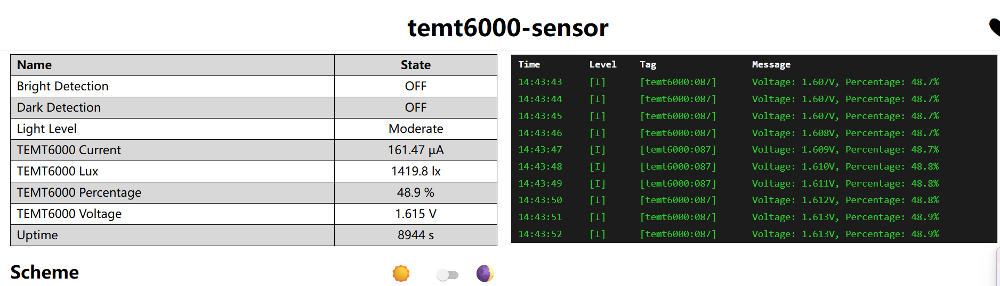

# 自动屏幕亮度调节工具

[](https://github.com/14790897/auto_display_light/actions/workflows/build-all.yml)

基于 ESPHome TEMT6000 光照传感器的 Windows 屏幕亮度自动调节工具。

## ✨ 功能特点

- 🌞 **自动亮度调节** - 根据环境光线自动调整屏幕亮度
- 🎨 **系统托盘运行** - 最小化到系统托盘，不占用任务栏
- ⚙️ **图形化配置** - 可视化设置界面，无需编辑代码
- 🚀 **开机自启动** - 一键启用/禁用开机自启动
- 💾 **配置持久化** - 设置自动保存，重启后保持
- 🔌 **传感器测试** - 内置连接测试功能
- 🎯 **防抖动机制** - 避免屏幕忽明忽暗

## 📋 系统要求

- Windows 10/11
- [Twinkle Tray](https://github.com/xanderfrangos/twinkle-tray) (用于控制屏幕亮度)
- **Bonjour Service** (用于 mDNS 域名解析，如 `temt6000-sensor.local`)
- ESPHome TEMT6000 光照传感器 (或兼容的传感器)

### 安装 Bonjour Service

Windows 默认不支持 mDNS，需要安装 Apple Bonjour：

```powershell
# 使用 winget 安装（推荐）
winget install --id=Apple.Bonjour -e

# 或从 Apple 官网下载安装
# https://support.apple.com/kb/DL999
```

安装后重启电脑，即可使用 `http://temt6000-sensor.local` 访问传感器。

## 🚀 快速开始

### 下载使用（推荐）

1. 从 [Releases](../../releases) 下载 `AutoDisplayLight.exe`
2. 双击运行程序
3. 在系统托盘找到太阳图标 ☀️
4. 右键图标 → **设置** → 配置传感器和 Twinkle Tray
5. 点击 **启动服务** 开始使用

### 从源代码运行

```powershell
# 克隆仓库
git clone https://github.com/14790897/auto_display_light.git
cd auto_display_light

# 安装依赖
pip install -r requirements.txt

# 运行程序
python autolight_tray.py
```

### 打包成 EXE

```powershell
# 安装依赖
pip install -r requirements.txt

# 打包
.\build.ps1

# 生成的文件在 dist\AutoDisplayLight.exe
```

## 📖 使用说明

### 首次配置

1. **右键托盘图标** → **设置**
2. 配置以下参数：

   **传感器设置**

   - 传感器地址：`http://your-sensor.local/sensor/sensor_name`

   **Twinkle Tray 设置**

   - 程序路径：点击"浏览"选择 `Twinkle Tray.exe`

   **运行参数**

   - 刷新间隔：5 秒（推荐）
   - 最小亮度：10% （防止屏幕过暗）
   - 最大亮度：100%
   - 灵敏度阈值：3% （亮度变化超过此值才调节）

   **界面选项**

   - ✅ 启动时最小化到托盘

3. 点击 **测试连接** 确认传感器正常
4. 点击 **保存**

### 启用开机自启动

在设置界面底部：

1. 点击 **启用开机自启动**
2. 确认成功提示
3. 下次登录时程序将自动启动

### 托盘菜单

右键托盘图标可以：

- **显示主窗口** - 查看详细信息和状态
- **启动/停止服务** - 控制自动亮度调节
- **设置** - 打开配置界面
- **退出** - 完全关闭程序

## 🔧 配置说明

配置文件位置：`%USERPROFILE%\AutoDisplayLight_config.json`

```json
{
  "sensor_url": "http://temt6000-sensor.local/sensor/temt6000_percentage",
  "tt_path": "C:\\...\\Twinkle Tray.exe",
  "interval": 5,
  "min_brightness": 10,
  "max_brightness": 100,
  "threshold": 3,
  "enabled": true,
  "start_minimized": true
}
```

## 🛠️ ESPHome 传感器配置

### 固件配置文件说明

仓库提供**两套固件配置**，对应两种硬件方案，请根据你的硬件选择：

| 配置文件 | 框架 | 适用硬件 | 电路特性 | 光照转换 | 设备名 |
|----------|------|----------|----------|----------|--------|
| `esp32c3.yaml` | Arduino | TEMT6000 模块 + 杜邦线 | 模块自带放大，电压正比 | `pct = V/3.3*100` | temt6000-sensor |
| `temt-on-esp32c3.yaml` | ESP-IDF | 自制集成 PCB（见 [hardware/](hardware/HARDWARE_README.md)） | 共射极电路，电压反比 | `pct = (1-V/3.3)*100` | temt6000-integrated |

> ⚠️ **不要混用**：两套固件的光照转换公式相反，刷错会导致"光越强读数越低"。模块版（正比）和集成版（反比）的 TEMT6000 接线方式不同，详见各 yaml 文件头部注释。

两个配置共享以下功能：

- **TEMT6000 光照传感器** - 模拟信号读取（ADC）
- **WiFi Portal** - 自动配网门户
- **Web 服务器** - 内置网页监控
- **HTTP API** - RESTful 接口供其他设备调用
- **OTA 更新** - 无线固件升级
- **UDP 广播** - 局域网实时数据推送（可选）

集成版（`temt-on-esp32c3.yaml`）额外包含：
- **GPIO12/13 板载 LED 控制** - 启动时关闭以省电（airm2m 板 DIO flash 模式下这两个引脚可安全用作 GPIO）
- **WiFi 发射功率限制** - 此板 C3 功率过高会死机，限制为 13.0
- **USB-Serial/JTAG 日志输出** - ESP-IDF 框架下的日志通道

### 配置文件位置

```
auto_display_light/
├── esp32c3.yaml              # 模块版固件配置 (Arduino)
├── temt-on-esp32c3.yaml      # 集成版固件配置 (ESP-IDF)
└── hardware/                 # 集成版 PCB 硬件文件 (Gerber + 工程)
```

### 主要配置项说明

| 配置项 | 说明 | 默认值 |
|--------|------|--------|
| `wifi.ssid` | WiFi 名称（从 secrets.yaml 读取） | - |
| `wifi.password` | WiFi 密码（从 secrets.yaml 读取） | - |
| `ap.ssid` | 备用热点名称 | `TEMT6000-Sensor` |
| `ap.password` | 备用热点密码 | `12345678ABCD` |
| `web_server.port` | Web 服务器端口 | `80` |
| `sensor.update_interval` | 传感器更新间隔 | `1s` |

### WiFi Portal 配网功能

当设备无法连接配置的 WiFi 时，会自动创建配网热点：

1. **连接热点**：SSID `TEMT6000-Sensor`，密码 `12345678ABCD`
2. **打开浏览器**：访问 `http://192.168.4.1` 或任意网址
3. **选择 WiFi**：在配网页面中选择并输入 WiFi 密码
4. **保存配置**：设备重启后自动连接新 WiFi

### 传感器接线

```
ESP32-C3 3.3V  → TEMT6000 VCC (V)
ESP32-C3 GND   → TEMT6000 GND (G)
ESP32-C3 GPIO3 ← TEMT6000 OUT (S)
```

### HTTP API 接口

| 接口 | 方法 | 返回示例 |
|------|------|----------|
| `/sensor/temt6000_percentage` | GET | `{"value": 45.2}` |
| `/sensor/temt6000_lux` | GET | `{"value": 650.3}` |
| `/sensor/temt6000_voltage` | GET | `{"value": 1.492}` |
| `/text_sensor/light_level` | GET | `{"value": "Moderate"}` |

### 使用 secrets.yaml

在 ESPHome 配置目录创建 `secrets.yaml`：

```yaml
wifi_ssid: "YOUR_WIFI_NAME"
wifi_password: "YOUR_WIFI_PASSWORD"
```

### 编译与上传

```powershell
# 编译并上传到设备
esphome run esp32c3.yaml

# 仅编译固件
esphome compile esp32c3.yaml

# OTA 更新（设备已连网）
esphome run esp32c3.yaml --device temt6000-sensor.local
```

### 完整配置示例

```yaml
sensor:
  - platform: adc
    pin: GPIO3
    name: "TEMT6000 Voltage"
    id: temt6000_voltage
    update_interval: 1s
    attenuation: 12db
    accuracy_decimals: 3

  - platform: template
    name: "TEMT6000 Percentage"
    id: temt6000_percentage
    unit_of_measurement: "%"
    lambda: |-
      return (id(temt6000_voltage).state / 3.3) * 100.0;
```

## 🎯 工作原理

```
ESPHome 传感器
  ↓ (HTTP JSON)
获取环境亮度百分比
  ↓
应用最小/最大亮度限制
  ↓
判断变化是否超过阈值
  ↓
调用 Twinkle Tray 调节屏幕
```

## 🔍 常见问题

### Q: 杀毒软件报毒？

**A:** PyInstaller 打包的程序可能被误报，添加到白名单即可。

### Q: 托盘图标不显示？

**A:** 检查系统托盘设置，Windows 11 在任务栏设置中可以配置显示所有图标。

### Q: 传感器连接失败？

**A:**

1. 确认传感器 URL 正确
2. 确认传感器在同一网络
3. 在设置中点击"测试连接"诊断问题

### Q: 屏幕亮度不变化？

**A:**

1. 确认 Twinkle Tray 路径正确
2. 确认 Twinkle Tray 可以正常控制屏幕
3. 检查最小/最大亮度设置
4. 调低灵敏度阈值

### Q: 如何完全卸载？

**A:**

1. 右键托盘图标 → 设置 → 禁用开机自启动
2. 右键托盘图标 → 退出
3. 删除程序文件
4. 删除配置文件：`%USERPROFILE%\AutoDisplayLight_config.json`

## 📦 项目结构

```
auto_display_light/
├── autolight.py           # 主程序源代码
├── autolight.spec         # PyInstaller 配置
├── esp32c3.yaml           # ESPHome 固件配置
├── build.ps1              # 打包脚本
├── requirements.txt       # Python 依赖
├── README.md              # 本文档
├── hardware/              # 集成版 PCB 硬件设计（Gerber + EDA 工程）
│   ├── gerber/            # PCB 制造文件（直接发板厂）
│   ├── project/           # 嘉立创 EDA 工程源文件
│   └── HARDWARE_README.md # 硬件设计说明
└── dist/                  # 打包输出
    └── AutoDisplayLight.exe
```

## 🛡️ 技术栈

- **GUI 框架**: Tkinter
- **系统托盘**: pystray
- **图像处理**: Pillow
- **HTTP 请求**: requests
- **打包工具**: PyInstaller
- **任务计划**: Windows Task Scheduler
- **亮度控制**: Twinkle Tray

## 📝 开发计划

- [ ] 添加亮度曲线自定义功能
- [ ] 支持多显示器独立控制
- [ ] 添加日志记录功能
- [ ] 支持更多传感器类型
- [ ] 添加夜间模式

## 🤝 贡献

欢迎提交 Issue 和 Pull Request！

## 📄 许可证

MIT License

## 🙏 致谢

- [Twinkle Tray](https://github.com/xanderfrangos/twinkle-tray) - 屏幕亮度控制工具
- [ESPHome](https://esphome.io/) - ESP 设备固件框架

---

⭐ 如果这个项目对你有帮助，请给个 Star！

## 固件文件位置

### 固件文件说明

CI 会构建两套固件，Release 页面提供以下文件：

| 文件名 | 大小 | 适用硬件 | 用途 | 上传方式 |
|--------|------|----------|------|----------|
| **firmware.factory.bin** | ~1.0 MB | 模块版（杜邦线） | ✅ 完整固件（推荐首次烧录） | USB 串口 |
| firmware.ota.bin | ~944 KB | 模块版（杜邦线） | OTA 更新专用 | OTA |
| **firmware-integrated.factory.bin** | ~1.0 MB | 集成版 PCB | ✅ 完整固件（推荐首次烧录） | USB 串口 |
| firmware-integrated.ota.bin | ~944 KB | 集成版 PCB | OTA 更新专用 | OTA |
| AutoDisplayLight.exe | ~22.4 MB | Windows 客户端 | 屏幕亮度自动调节工具 | 直接运行 |

> 选哪个？用 TEMT6000 模块 + 杜邦线接 ESP32-C3 → 选 `firmware.*`；用自己焊的集成版 PCB（[hardware/](hardware/HARDWARE_README.md)）→ 选 `firmware-integrated.*`。

---

## 方法 1：ESPHome 自动上传（最简单）

### 前提条件

- ESP32-C3 通过 USB 连接到电脑
- 已安装 ESPHome

### 步骤

```powershell
# 在项目根目录执行
cd auto_display_light

# 自动编译并上传
esphome run esp32c3.yaml
```

ESPHome 会自动：

1. 编译固件
2. 检测串口
3. 上传固件
4. 显示日志

---

## 方法 2：使用 esptool.py 手动烧录（推荐备份）

### 安装 esptool

```powershell
pip install esptool
```

### 查找串口号

```powershell
# Windows
mode
# 或者在设备管理器中查看 "端口(COM 和 LPT)"
```

假设是 **COM3**

### 烧录完整固件（首次使用）

```powershell
esptool.py --chip esp32c3 --port COM3 --baud 460800 write_flash 0x0 "firmware_output/firmware.factory.bin"
```

**参数说明：**

- `--chip esp32c3`：芯片型号
- `--port COM3`：串口号（根据实际情况修改）
- `--baud 460800`：波特率（可选：115200, 230400, 460800, 921600）
- `write_flash 0x0`：从地址 0x0 开始写入
- 最后是固件路径

### 擦除 Flash（可选，遇到问题时使用）

```powershell
esptool.py --chip esp32c3 --port COM3 erase_flash
```

---

## 方法 3：使用 Flash Download Tool（图形界面）

### 下载工具

https://www.espressif.com.cn/zh-hans/support/download/other-tools

### 烧录步骤

1. **打开 Flash Download Tool**
2. **选择芯片类型**：ESP32-C3
3. **配置烧录文件**：

   | 文件路径               | 地址 | 勾选 |
   | ---------------------- | ---- | ---- |
   | `firmware.factory.bin` | 0x0  | ✅   |

4. **配置串口**：

   - COM Port: COM3（根据实际修改）
   - Baud: 460800

5. **点击 START** 开始烧录

---

## 方法 4：OTA 无线更新（已烧录过固件）

### 前提条件

- ESP32 已连接 WiFi
- 已烧录过包含 OTA 功能的固件

### 步骤

```powershell
# 通过 WiFi 更新（设备名：temt6000-sensor）
esphome run esp32c3.yaml --device temt6000-sensor.local
```

或者在 ESPHome Dashboard 中点击 "UPLOAD" → "Wirelessly"

---

## 烧录后验证

### 1. 串口日志

```powershell
# ESPHome 日志
esphome logs esp32c3.yaml

# 或使用 Arduino Serial Monitor / PuTTY / minicom
# 波特率：115200
```

应该看到：

```
[I][temt6000:xxx]: Voltage: 1.234V, Percentage: 37.4%
[I][udp:xxx]: Broadcast: {"device":"temt6000","percentage":37.4,"lux":520.3,"voltage":1.234}
```

### 2. Web 界面

浏览器访问：

```md
http://temt6000-sensor.local
```



### 3. HTTP API 测试

```powershell
# 获取光照百分比
curl http://temt6000-sensor.local/sensor/temt6000_percentage

# 获取 Lux 值
curl http://temt6000-sensor.local/sensor/temt6000_lux
```

---

## 常见问题

### 1. 找不到串口

**原因**：

- 未安装 USB 转 UART 驱动（CH340/CP2102）

**解决**：

- 下载驱动：https://www.wch.cn/downloads/CH341SER_EXE.html

### 2. 烧录失败："Failed to connect"

**解决**：

1. 按住 ESP32-C3 的 **BOOT 按钮**
2. 点击 **RST 按钮** 复位
3. 松开 RST，保持 BOOT 按住
4. 开始烧录
5. 烧录开始后松开 BOOT

### 3. WiFi 连接失败

**检查**：

- `secrets.yaml` 中 `wifi_ssid` 和 `wifi_password` 是否正确
- WiFi 是否为 2.4GHz（ESP32 不支持 5GHz）

**备用方案**：
设备会自动创建热点：

- SSID: `TEMT6000-Sensor`
- 密码: `12345678ABCD`

连接后访问 `http://192.168.4.1` 配置 WiFi

## 硬件接线

```
ESP32-C3 3.3V  → TEMT6000 VCC (V)
ESP32-C3 GND   → TEMT6000 GND (G)
ESP32-C3 GPIO3 ← TEMT6000 OUT (S)
```

### 集成版 PCB（可选）

如果你不想用杜邦线外接传感器模块，可以使用本仓库的集成版 PCB 设计——将 TEMT6000 直接集成到 ESP32-C3 最小系统板上。完整设计文件、焊接工艺、调试过程详见 [hardware/HARDWARE_README.md](hardware/HARDWARE_README.md)。

---

## 固件版本信息

- **设备名称**：temt6000-sensor
- **芯片型号**：ESP32-C3
- **固件文件**：从 Releases 页面下载或通过 CI 自动构建

---

## 进阶功能

### 修改 UDP 端口

编辑 `esp32c3.yaml`，修改：

```yaml
udp:
  id: udp_broadcast
  port: 9999 # 改为新端口
```

然后重新编译上传。

### 调整广播频率

传感器每秒更新一次，如需降低频率，修改：

```yaml
sensor:
  - platform: template
    name: "TEMT6000 Percentage"
    update_interval: 5s # 改为 5 秒
```

### 添加 MQTT 支持

如果需要 MQTT，在配置中添加：

```yaml
mqtt:
  broker: 192.168.1.100
  port: 1883
  username: !secret mqtt_user
  password: !secret mqtt_password
```

---

**祝烧录顺利！** 🚀
